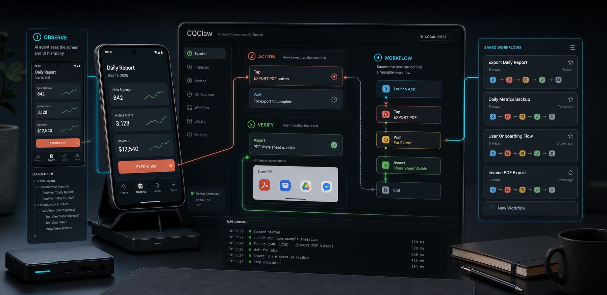
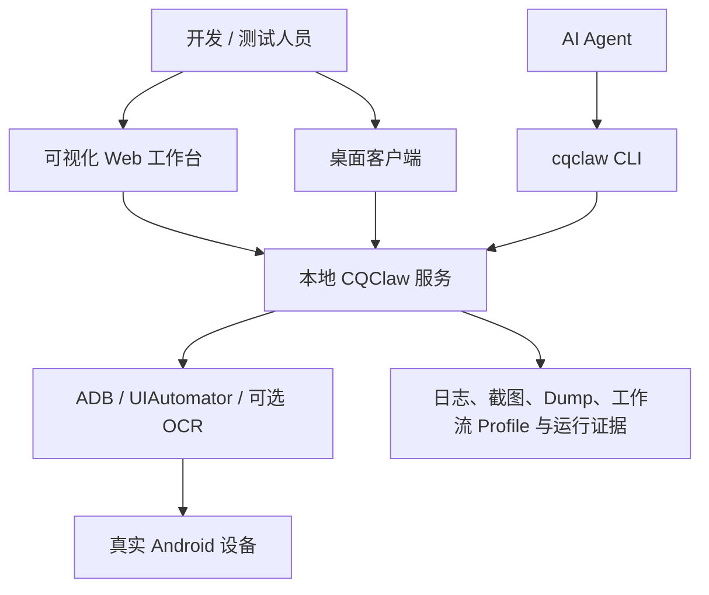
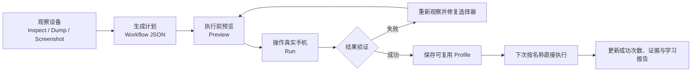

<div align="center">

# CQClaw

**让 Agent 观察、操作并学会复用真实 Android 工作流**

本地优先的 Android 自动化工作台，集成 Web 控制台、桌面客户端、CLI、日志洞察、设备管理与可安装 Agent Skill。

[下载客户端](https://github.com/chu-jue/CQClaw-New/releases) · [安装 Skill](#安装-agent-skill) · [查看功能](#完整功能) · [CLI 示例](#agent-cli)

</div>



<div align="center">
  <sub>主视觉由 OpenAI 图像生成能力创建；产品模块图来自项目内置视觉资产。</sub>
</div>

## 核心价值

**CQClaw 是一个 AI 驱动的 Android 自动化测试平台。**

它既提供可视化界面，让开发和测试人员低成本编排手机自动化流程；也提供 CLI 能力，让 AI Agent 可以直接观察手机、操作手机、生成并执行测试脚本。

**它解决的问题：**传统 Android 自动化测试门槛高、脚本维护成本大、手工回归效率低。CQClaw 让团队可以用“可视化编排 + AI 自动生成”的方式，快速沉淀可复用测试流程。

**典型场景：**回归测试、开发自测、问题复现、日志排查、多设备验证、AI 自动化执行。

**核心价值：**让公司用更低的人力和技术成本，提升测试效率、问题定位效率和自动化覆盖率。

> **一句话：CQClaw 让 AI 真正操作手机，把人工测试流程快速变成可视化、可复用、可自动执行的测试资产。**

## 评委快速看

- **可视化**：把安装、启动、点击、输入、截图、日志检查等测试步骤拖进工作流，低成本生成自动化脚本。
- **AI 可执行**：通过 `cqclaw` CLI，AI Agent 可以观察真实手机、操作真实手机、验证结果并保存流程。
- **闭环沉淀**：一次人工/AI 任务可以变成可复用 Profile，后续回归测试直接执行。
- **公司价值**：减少手工回归和问题复现成本，提升测试覆盖率、定位效率和团队交付速度。

## 产品界面

<table>
  <tr>
    <td width="50%">
      
      <br><strong>自动化编排</strong><br>
      面向用户和 Agent 的统一流程编辑器，支持预览、执行、保存与复用。
    </td>
    <td width="50%">
      
      <br><strong>日志洞察</strong><br>
      实时 Logcat、文件导入、过滤、Crash/ANR 定位和规则化问题识别。
    </td>
  </tr>
  <tr>
    <td width="50%">
      
      <br><strong>节点解析</strong><br>
      将 UIAutomator Dump 转换为可查询节点，帮助 Agent 选择稳定的操作目标。
    </td>
    <td width="50%">
      
      <br><strong>资源中心</strong><br>
      集中预览和管理截图、Dump、日志、APK、临时脚本与工作流导出。
    </td>
  </tr>
</table>

## 架构亮点



CQClaw 让“人”和“AI”共用同一套手机自动化能力：人用界面低成本编排，AI 用 CLI 自动执行和沉淀。

## CQClaw 是什么

CQClaw 把 Android 设备控制、UI 检查、自动化编排和运行证据统一在一个本地工作台中。

普通用户可以在 Web 或桌面客户端里管理手机、分析日志和执行流程；Agent 则可以通过结构化 CLI 观察当前页面、完成任务、验证结果，并把成功步骤保存为下一次可以直接执行的工作流。

**核心特点**

- **Agent 真正操作手机**：读取前台 Activity、UI Dump、截图和应用信息，再执行点击、输入、Shell、文件传输等动作。
- **从一次任务变成可复用流程**：首次执行后保存为工作流 Profile，之后可以直接按名称预览、执行和查看验证报告。
- **证据驱动**：运行结果返回结构化 JSON、步骤状态、截图路径、Dump 路径和学习报告，而不是只告诉用户“已完成”。
- **本地优先**：服务、设备数据、日志、截图和工作流都保存在用户电脑中。
- **多种使用入口**：桌面客户端、Web 控制台、`cqclaw` CLI 和可安装 Agent Skill 共用同一套能力。

## 安装 Agent Skill

> 先安装并启动 CQClaw 客户端，再安装 Skill。Skill 会教 Agent 如何调用用户电脑上的 CQClaw，不包含或替代客户端本身。

使用 [`skills`](https://skills.sh/) CLI 安装：

```bash
npx skills add chu-jue/CQClaw-New \
  --skill cqclaw-android-automation \
  --agent codex \
  -g -y
```

查看仓库内可安装的 Skill：

```bash
npx skills add chu-jue/CQClaw-New --list
```

安装完成后，可以直接对 Agent 说：

```text
帮我查看当前连接的手机，打开目标应用并完成登录。
成功后验证结果，并保存成“应用登录”工作流，下次直接复用。
```

Skill 会优先检查已有工作流；没有匹配方案时，按照“观察 → 计划 → 预览 → 执行 → 验证 → 保存”的流程学习新任务。

## Agent 学习闭环



保存后的工作流不再依赖首次生成的临时 JSON。Agent 和用户都可以在之后直接复用：

```bash
cqclaw agent workflow list
cqclaw agent workflow preview --profile "应用登录" --devices SERIAL
cqclaw agent workflow run --profile "应用登录" --devices SERIAL
cqclaw agent workflow report --name "应用登录"
```

每次执行已保存 Profile 后，CQClaw 会更新：

- `verified` 与最近验证时间
- 成功、失败执行次数
- 最近运行 ID 和步骤结果
- 截图、Dump 等证据路径
- 最新学习报告

## 完整功能

| 模块 | 能力 |
| --- | --- |
| **Agent Skill** | 自动发现本地 CQClaw CLI；观察设备；生成、预览、执行、修复并保存工作流；优先复用已有 Profile |
| **Agent CLI** | 全部命令返回机器可读 JSON；支持设备、截图、Dump、前台 Activity、应用、剪切板、Shell 与工作流操作 |
| **自动化编排** | 安装 APK、智能点击、应用操作、输入文本、剪切板、截图、录屏、文件推送/提取、权限、按键、本机脚本、页面脚本 |
| **可复用工作流** | 保存、列出、查看、预览、执行、删除 Profile；记录验证状态、成功/失败次数、运行证据与学习报告 |
| **智能 UI 操作** | 基于文字、Content Description、Resource ID 和 UI Dump 定位；可选 EasyOCR 兜底 |
| **日志洞察** | 实时抓取 Logcat、导入日志文件、按 Package/Tag/Message 过滤、多级日志颜色、Crash/ANR 与规则化问题识别 |
| **设备管理** | 多设备发现、详情查看、应用列表、Shell、截图、前台页面、设备文件与手机端桥接服务 |
| **节点解析器** | 截图与 UI XML 联合分析；输出节点属性、边界、中心坐标、可点击状态与匹配结果 |
| **资源中心** | 查看空间占用，预览并打开各类输出目录，管理截图、Dump、日志、APK 缓存与工作流导出 |
| **桌面客户端** | Tauri 桌面控制中心；启动/停止服务；查看健康状态；快速进入常用模块；支持托盘运行 |
| **本地服务管理** | `start`、`stop`、`restart`、`status`、`doctor`、日志查看与用户登录自启动 |
| **企业配置** | 可配置 `enterprise-source.json` 路径，适配不同用户电脑上的企业资源和分发环境 |
| **跨平台发布** | GitHub Tag 自动构建 Windows 安装包与 macOS App，并生成 Release 产物 |

## 快速开始

### 方式一：安装发布版

从 [GitHub Releases](https://github.com/chu-jue/CQClaw-New/releases) 下载对应平台安装包，安装后启动 CQClaw 客户端。

发布 Windows 安装包前，如果要内置手机端能力，把二进制放到：

```text
data/agent/CQClawAgent.apk
data/agent/cqclaw-agent-server.jar
```

没有用户或企业路径配置时，CQClaw 会自动使用这两个随安装包分发的内置文件。

确认服务与设备：

```bash
cqclaw status
cqclaw agent devices --online
```

### 方式二：从源码安装

macOS / Linux：

```bash
git clone https://github.com/chu-jue/CQClaw-New.git
cd CQClaw-New
./install.sh
cqclaw start
```

需要 OCR 兜底能力时：

```bash
./install.sh --with-ocr
# 或稍后执行
cqclaw install-ocr
```

Windows：

```bat
git clone https://github.com/chu-jue/CQClaw-New.git
cd CQClaw-New
install-windows.bat
cqclaw start
```

默认 Web 控制台地址：

```text
http://127.0.0.1:8765/
```

## Agent CLI

### 观察设备

```bash
cqclaw agent locate
cqclaw agent ensure
cqclaw agent devices --online
cqclaw agent inspect --serial SERIAL
cqclaw agent dump --serial SERIAL --query "登录"
cqclaw agent screenshot --serial SERIAL
cqclaw agent top-activity --serial SERIAL
```

### 执行操作

```bash
cqclaw agent shell --serial SERIAL -- getprop ro.product.model
cqclaw agent clipboard read --serial SERIAL
cqclaw agent clipboard write --serial SERIAL --text "hello"
cqclaw agent apps --serial SERIAL --no-include-system --quick
```

### 学习并复用工作流

```bash
# 查看工作流 Schema
cqclaw agent workflow schema

# 首次生成后，先预览再执行
cqclaw agent workflow preview --file flow.json --devices SERIAL
cqclaw agent workflow run --file flow.json --devices SERIAL

# 验证成功后保存
cqclaw agent workflow save \
  --file flow.json \
  --name "应用登录" \
  --source learned

# 后续无需原始 JSON，直接按名称复用
cqclaw agent workflow list
cqclaw agent workflow show --name "应用登录"
cqclaw agent workflow preview --profile "应用登录" --devices SERIAL
cqclaw agent workflow run --profile "应用登录" --devices SERIAL
cqclaw agent workflow report --name "应用登录"
```

## 常用服务命令

```bash
cqclaw start
cqclaw stop
cqclaw restart
cqclaw status
cqclaw doctor
cqclaw logs

cqclaw autostart enable
cqclaw autostart status
cqclaw autostart disable
```

## 项目结构

```text
backend/                         本地 HTTP 服务与 Android 自动化执行能力
desktop/tauri-client/            跨平台桌面客户端
skills/cqclaw-android-automation Agent Skill
static/                          Web 控制台
tools/aas_cli.py                 cqclaw CLI 与 Agent JSON 接口
packaging/                       Windows / macOS 打包脚本
.github/workflows/               CI 与 Tag Release 构建
```

## 开发检查

```bash
python3 -m py_compile \
  server.py \
  backend/legacy_core.py \
  tools/aas_cli.py

node --check static/js/workflow/index.js

cd desktop/tauri-client
npm ci
npx tauri --version
```

## 发布

推送 `v*` Tag 会触发 GitHub Actions，构建 Windows 安装包和 macOS App，并发布到 GitHub Releases。

```bash
git tag vX.Y.Z
git push origin vX.Y.Z
```

---

CQClaw 的目标不是只让 Agent “给出步骤”，而是让它在真实设备上完成任务、留下证据，并把成功经验变成下一次可以直接执行的工作流。
