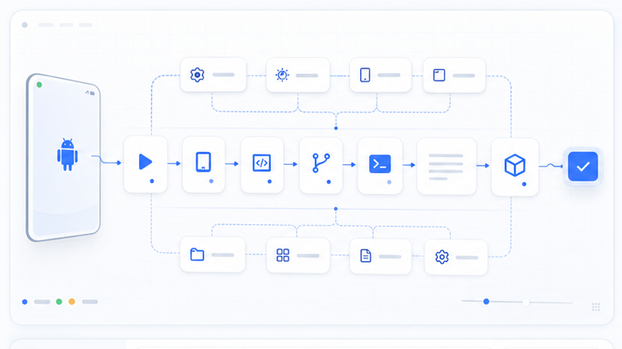
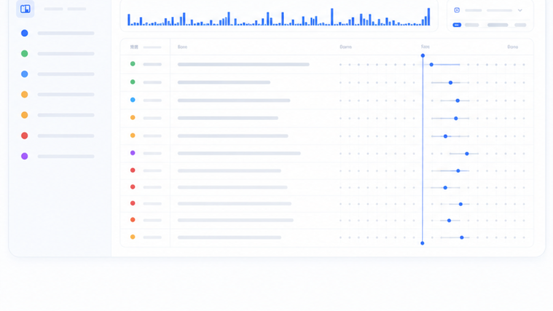
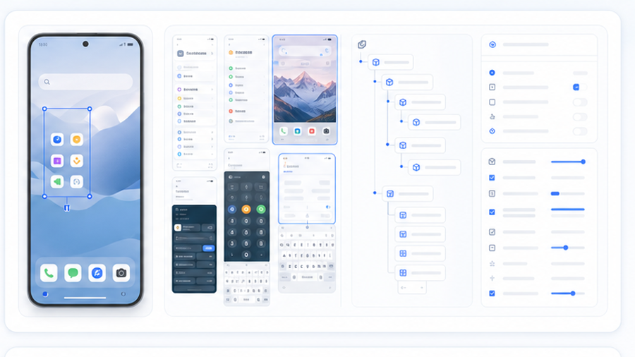
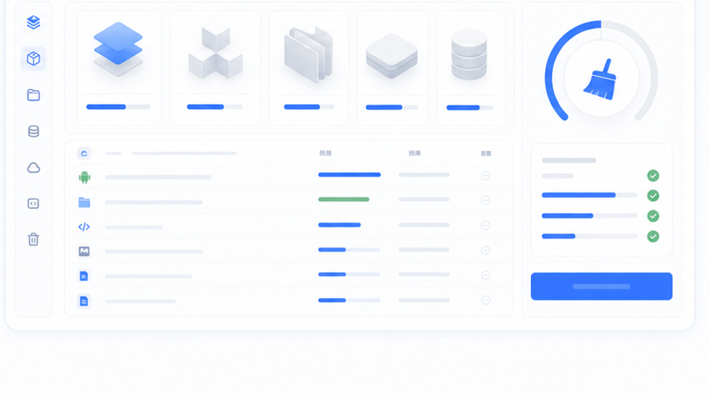
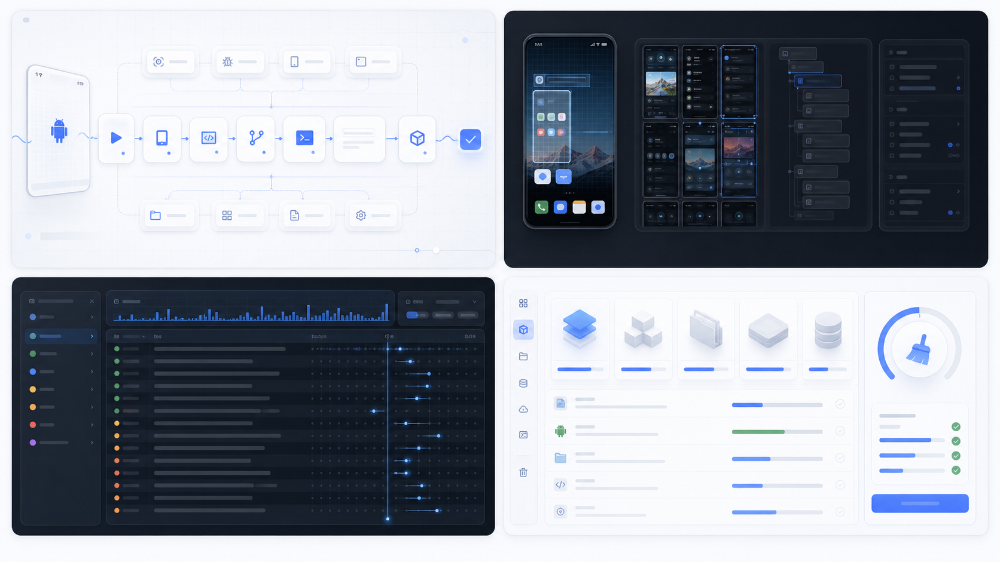
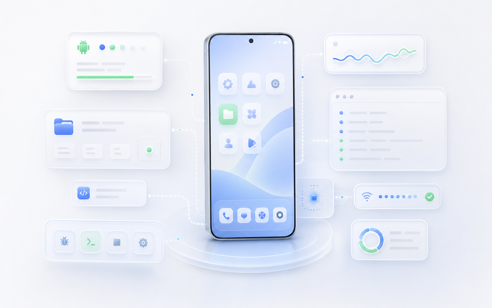

# CQClaw 路演介绍文档

## 一句话介绍

CQClaw 是一个本地优先的 Android Agent 自动化工作台。它让 Agent 不只是“告诉用户怎么操作手机”，而是可以观察真实设备、执行真实动作、验证真实结果，并把一次成功任务沉淀成下一次可直接复用的工作流。

## 项目定位

传统 Agent 擅长给出建议、生成步骤和解释问题，但当任务落到真实 Android 设备上时，往往会遇到三个断点：

- Agent 看不到手机当前页面，只能猜测下一步。
- Agent 执行后缺少证据，无法确认任务是否真的完成。
- 一次成功经验很难复用，下次还要重新分析、重新操作。

CQClaw 解决的是这个“从回答到执行”的断点。它把 Android 设备控制、UI 节点解析、日志洞察、自动化编排、运行证据和 Agent Skill 连接在一起，让 Agent 可以进入一个真实、可验证、可复用的执行环境。

## 核心价值

### 1. Agent 可以真正操作真实手机

CQClaw 通过本地服务和 ADB / UIAutomator / OCR 能力，让 Agent 能够读取设备状态并执行操作：

- 查看在线设备、设备型号、系统版本和前台 Activity。
- 获取当前页面截图和 UI Dump。
- 根据文字、Content Description、Resource ID 或坐标点击控件。
- 执行输入、返回、Home、Shell、剪切板、文件推送和提取。
- 保存截图、Dump、日志和执行结果作为证据。

这意味着 Agent 不再停留在“建议用户点击哪里”，而是可以自己观察、点击、输入、验证。

### 2. 一次任务可以沉淀为可复用工作流

CQClaw 的自动化编排不仅支持一次性执行，还支持把成功路径保存为 Profile：

- 首次执行时，Agent 生成工作流 JSON。
- 执行前先 Preview，让用户看到即将发生什么。
- 执行后收集步骤状态、截图、Dump 和日志。
- 成功后保存为命名工作流 Profile。
- 下次用户或 Agent 可以直接按名称预览、执行和查看报告。

这让 CQClaw 从“工具调用”升级成“技能积累”。Agent 每完成一次真实任务，就能多一项可复用能力。

### 3. 结果不是一句“完成了”，而是有证据

CQClaw 的执行结果面向 Agent 友好，CLI 返回机器可读 JSON，并包含：

- 每一步是否成功。
- 失败原因和错误输出。
- 截图路径。
- UI Dump 路径。
- 日志与运行产物。
- Profile 的验证状态、成功次数和失败次数。

这套证据机制让 Agent 可以继续判断、修复和复盘，而不是只凭一句自然语言报告结果。

## 强大功能模块

### 应用截图与功能展示

这些截图展示了 CQClaw 的主要使用入口。路演时可以先用截图快速建立产品感，再进入真实设备演示。

| 自动化编排 | 日志洞察 |
| --- | --- |
|  |  |
| 面向用户和 Agent 的统一流程编辑器，支持安装 APK、智能点击、脚本节点、预览、执行、保存与复用。 | 面向日常排查的日志工作台，支持实时 Logcat、导入日志文件、过滤、高亮、上下文和关键 Android 日志 Timeline。 |

| 节点解析 | 资源中心 |
| --- | --- |
|  |  |
| 将设备截图、UI XML、节点树、bounds 和推荐命令联动起来，帮助 Agent 选择稳定操作目标。 | 集中预览和管理截图、Dump、日志、APK、临时脚本、工作流导出和运行产物。 |

| 工作台模块总览 | 设备控制台 |
| --- | --- |
|  |  |
| 展示 CQClaw 的自动化、日志、节点、资源等模块如何组成统一工作台。 | 连接真实 Android 设备，查看状态、安装手机端能力，并快速进入日志洞察和节点解析。 |

### Agent Skill

CQClaw 提供可安装的 Agent Skill。用户安装客户端后，再安装 skill，Agent 就知道如何调用用户电脑上的 CQClaw CLI。

Skill 的重点不是替代客户端，而是把 CQClaw 的能力变成 Agent 可理解、可调用、可验证的方法：

- 自动检查本机是否有兼容的 `cqclaw` CLI。
- 优先使用 `cqclaw agent locate` 确认环境可用。
- 通过 JSON 接口观察设备和执行动作。
- 失败时停止并提示用户安装或更新 CQClaw。
- 完成任务后保存或复用工作流 Profile。

这让 CQClaw 具备很强的参赛亮点：它展示的是 Agent 使用 Skill 连接真实设备的完整闭环，而不是一个孤立 Demo。

### Agent CLI

CQClaw CLI 是 Agent 的稳定调用面。它支持：

- `cqclaw agent devices`：查看在线设备。
- `cqclaw agent inspect`：检查设备状态。
- `cqclaw agent dump`：解析当前 UI 节点。
- `cqclaw agent screenshot`：保存截图证据。
- `cqclaw agent shell`：执行 ADB Shell。
- `cqclaw agent workflow preview`：预览工作流。
- `cqclaw agent workflow run`：执行工作流。
- `cqclaw agent workflow save`：保存为可复用 Profile。
- `cqclaw agent workflow report`：查看最近执行证据。

CLI 的所有关键输出都可以被 Agent 解析，适合作为自动化、学习和修复的底层接口。

### 自动化编排

Web 自动化页面向普通用户和 Agent 共同设计。它支持可视化编排，也支持脚本式能力：

- 安装 APK。
- 智能点击。
- 应用启动、停止、清理数据、卸载。
- 输入文本、中文输入、剪切板读写。
- 截图、录屏、文件推送和提取。
- 权限处理、按键事件、Shell 命令。
- ADB / 自动化脚本节点。
- 本机脚本和页面脚本。

其中 ADB / 自动化脚本节点非常关键，它支持混写原生 ADB 和 CQClaw DSL：

```text
adb shell getprop ro.product.model
tapText("确定")
waitTextAndTap("登录", 5000)
```

这些 DSL 让自动化不只依赖固定坐标，而是可以通过文字、ID、OCR、等待、断言和重试来提高稳定性。

### 日志洞察

日志洞察是 CQClaw 的高频排查入口，适合日常 Android 问题定位：

- 实时抓取 Logcat。
- 支持导入 `.log` / `.txt` 日志文件。
- 多日志源统一查看。
- 按 Package、Tag、Message 过滤。
- 支持包含、排除、高亮和查找。
- 支持上下文查看，快速回到异常前后。
- 自动根据日志生成关键 Android 事件 Timeline，把 Activity、Crash、ANR、安装、权限、网络等线索整理成时间线。
- 支持 Crash / ANR 和规则化问题识别。
- 支持导出关键日志证据。

它的价值是把海量日志变成可定位的问题上下文和关键事件链。即使没有连接手机，用户也可以把别人发来的日志文件导入 CQClaw，自动生成时间线，继续排查问题。

### 节点解析

节点解析器把截图、UI XML、节点树和推荐命令整合在一起，帮助用户和 Agent 找到稳定操作目标：

- 刷新当前截图和 UI Dump。
- 在截图上叠加节点边界。
- 搜索 text / id / desc / class。
- 查看节点属性、bounds、中心坐标、可点击状态。
- 复制或执行推荐命令。
- 生成 `tapById`、`tapText`、`tapBounds`、`waitId`、`assertId` 等操作建议。

节点解析解决的是“Agent 到底应该点哪里”的问题。它让页面操作从猜测坐标，变成基于 UI 结构的可验证目标选择。

### 日志洞察 + 节点解析联合排查

这两个功能结合起来，是 CQClaw 在日常排查中的一个强亮点：

1. 日志洞察告诉用户：失败发生在哪里、为什么失败、相关上下文是什么。
2. 节点解析告诉 Agent：当前页面有什么控件、哪个目标更稳定、下一步应该怎么操作。
3. 自动化编排把修复后的步骤保存为工作流。

也就是说，CQClaw 不只帮助定位问题，还能把排查后的经验转成下一次可以执行的自动化能力。

### 资源中心

资源中心用于管理 CQClaw 执行过程中产生的各类文件：

- 截图。
- UI Dump。
- 日志。
- APK 缓存。
- 临时脚本。
- 工作流导出。
- 运行产物。

它让用户可以集中查看、预览、打开目录和清理资源，避免自动化运行后产物散落在各处。

### 桌面客户端

CQClaw 提供桌面客户端，降低普通用户启动和管理服务的门槛：

- 启动、停止和重启本地 CQClaw 服务。
- 查看服务健康状态。
- 快速打开 Web 控制台。
- 快速进入自动化、日志洞察、设备管理等模块。
- 支持托盘运行。
- 支持开机自启动相关管理。

这让 CQClaw 不只是开发者脚本，也更像一个真正可交付给用户使用的产品。

## 技术亮点

### 本地优先

CQClaw 默认在用户本机运行。设备命令、截图、Dump、日志和工作流都保存在用户自己的电脑上。

这对手机自动化尤其重要，因为 Android 设备中可能包含账号、通知、应用数据和业务日志。本地优先可以降低数据外传风险，也更适合企业内部分发和私有环境使用。

### 多入口统一能力

CQClaw 同时提供：

- Web 控制台。
- 桌面客户端。
- Agent CLI。
- Agent Skill。

这些入口背后共用同一套本地服务能力。普通用户可以通过可视化界面使用，Agent 可以通过 CLI 和 Skill 自动调用，开发者可以通过接口继续扩展。

### 面向 Agent 的结构化执行

CQClaw 的关键命令不是只输出人类可读文本，而是返回结构化 JSON。这让 Agent 可以：

- 判断执行是否成功。
- 读取失败原因。
- 找到截图和 Dump 证据。
- 根据当前页面重新修复选择器。
- 决定是否保存或复用 Profile。

这正是 Agent 工具化能力的核心：工具结果必须可解析、可验证、可继续推理。

### 从操作到学习的闭环

CQClaw 的完整链路是：

```text
观察设备 -> 生成计划 -> 执行前预览 -> 操作真实手机 -> 验证结果 -> 保存 Profile -> 下次复用
```

这个闭环把一次性自动化提升为持续积累的能力系统。每一个成功 Profile 都是 Agent 下一次可以直接调用的技能。

## 路演重点表达

### 可以这样开场

今天很多 Agent 可以告诉我们“手机上应该怎么点”，但它们通常看不到真实手机，也无法确认结果是否完成。CQClaw 想解决的是最后一公里问题：让 Agent 进入真实 Android 设备，自己观察、自己执行、自己验证，并把成功经验保存下来。

### 可以这样介绍核心差异

CQClaw 和普通 ADB 工具的区别在于，它不是只提供一堆命令按钮，而是把设备状态、UI 节点、日志证据、工作流 Profile 和 Agent Skill 连接成一个闭环。用户可以手动使用，Agent 也可以自动调用。

### 可以这样介绍参赛亮点

CQClaw 展示的不是一次 Demo，而是 Agent 使用 Skill 的完整能力：

- Skill 是能力入口：Agent 能找到并调用用户本地 CQClaw。
- Evidence 是完成标准：每次执行都有截图、Dump、日志和 JSON 结果。
- Profile 是长期记忆：成功任务可以保存，下次直接复用。

最终目标是让 Agent 从“会回答”升级为“会操作、会验证、会积累”。

## 推荐演示流程

### 演示一：Agent 操作真实手机

1. 打开 CQClaw 桌面客户端。
2. 展示本地服务运行状态。
3. 打开 Web 控制台查看在线设备。
4. 使用 Agent / CLI 获取当前 Activity、截图和 Dump。
5. 让 Agent 点击某个页面按钮或完成一个简单任务。
6. 展示返回的 JSON、截图和运行证据。

这一段证明：Agent 不是在模拟，而是在操作真实设备。

### 演示二：自动化工作流保存与复用

1. 让 Agent 根据目标生成工作流。
2. 先 Preview，展示执行步骤。
3. Run 后展示每一步结果。
4. 保存为 Profile。
5. 再次按名称直接执行。
6. 查看 workflow report。

这一段证明：CQClaw 不是一次性脚本，而是可以沉淀经验。

### 演示三：日志洞察日常排查

1. 打开日志洞察。
2. 实时抓取 Logcat 或导入 `.log / .txt` 文件。
3. 按 Package / Tag / Message 过滤。
4. 高亮 error、exception、timeout 等关键词。
5. 自动生成关键 Android 日志 Timeline，查看故障前后的事件链。
6. 导出关键证据。

这一段证明：CQClaw 可以用于真实开发和测试排查，而不只是自动点击。

### 演示四：节点解析辅助 Agent 稳定操作

1. 打开节点解析。
2. 刷新截图和 UI Dump。
3. 搜索按钮文字、Resource ID 或 class。
4. 查看 bounds 和中心点。
5. 复制推荐命令，例如 `tapById` 或 `waitTextAndTap`。
6. 把命令加入自动化脚本。

这一段证明：CQClaw 能把“点哪里”变成稳定、可验证、可复用的操作目标。

## 适用场景

CQClaw 适合这些场景：

- Android 应用日常调试。
- 自动化回归测试。
- 多设备批量操作。
- APK 安装和验证。
- UI 节点检查。
- Logcat 日志排查。
- Agent 辅助移动端任务执行。
- 企业内部设备自动化工具。
- 参赛演示中的 Agent Skill 能力展示。

## 当前亮点总结

| 亮点 | 说明 |
| --- | --- |
| 真实设备执行 | Agent 可以观察并操作真实 Android，不停留在文字建议 |
| 本地优先 | 服务、设备数据、日志和证据留在用户电脑 |
| Skill 可安装 | 用户安装 Skill 后，Agent 自动掌握 CQClaw 调用方式 |
| CLI 结构化 | 关键命令返回 JSON，适合 Agent 解析和继续决策 |
| 自动化编排 | 支持可视化流程、脚本节点和 Profile 复用 |
| 日志洞察 | 支持实时 Logcat、文件导入、过滤、Timeline 和问题识别 |
| 节点解析 | 截图与 UI XML 联动，输出稳定操作目标 |
| 证据驱动 | 每次执行都有截图、Dump、日志和运行报告 |
| 自学习闭环 | 成功任务可保存为 Profile，下次直接执行 |

## 结尾表达

CQClaw 的目标不是让 Agent 多生成一段操作说明，而是让 Agent 拥有一个真实 Android 执行环境。

它把手机状态、UI 节点、日志证据、自动化动作和可复用 Profile 连接起来，让每一次真实设备操作，都有机会成为 Agent 下一次可以直接调用的能力。

如果说普通 Agent 是“会回答”，CQClaw 想展示的是下一步：Agent 可以“会操作、会验证、会积累”。
